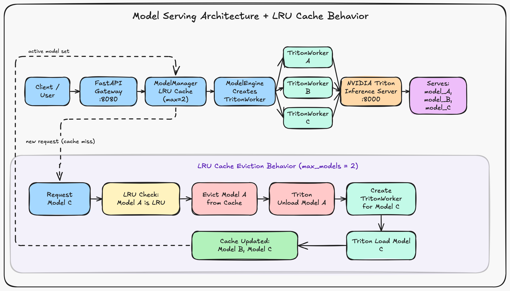

# Multi-Model Serving with NVIDIA Triton

## Multi-Model Serving

Serving a machine learning model is relatively straightforward when an application only needs one model. The situation becomes more interesting when a serving system has to support many models at the same time.

In a multi-model serving setup, several models share the same serving infrastructure instead of each model having its own dedicated serving process or machine. A request can specify which model it needs, and the serving system is responsible for making that model available and sending the request to it.

This is useful when there are many models but they are not all being used continuously. Keeping every model loaded all the time can be wasteful, especially when the models are large and GPU memory is limited.

Instead, a serving system can keep only a subset of the models active and load other models when they are requested.

This introduces a model lifecycle problem:

- Which models should currently be loaded?
- What should happen when a request arrives for a model that is not loaded?
- What should happen when there is no more room for another model?
- Which model should be removed to make room?

This is where a cache becomes useful.

## LRU Model Cache

A common strategy for managing the active models is an **LRU (Least Recently Used) cache**.

The basic idea is simple: models that have been used recently are more likely to be used again, while models that have not been used for some time are better candidates for removal.

The cache keeps track of the order in which models are accessed.

For example, suppose the serving system can keep two models active:

```text
Cache capacity = 2

Request A  ->  [A]
Request B  ->  [A, B]
```

Now a request arrives for model C.

The cache is full, so one model has to be removed. If A is the least recently used model, it is evicted:

```text
[A, B]  ->  remove A  ->  [B]
```

Model C can then be loaded:

```text
[B, C]
```

The important point is that the cache is not just storing arbitrary Python objects. In a model-serving system, removing a model can also mean unloading the actual model from the inference server and freeing the resources associated with it.

A cache hit is different. If model B is already active and another request arrives for B, there is no reason to load it again. The existing worker is reused and B becomes the most recently used model.

For example:

```text
[B, C]

Request B

[C, B]
```

Now C is the least recently used model and would be the first candidate for eviction if another model needs to be loaded.

This gives us a simple model-management policy:

```text
recently used models  -> keep
least recently used   -> evict
```

The size of the cache is therefore an important resource-management decision. A larger cache can reduce model reloads, but it also means that more models remain loaded and consume GPU memory. A smaller cache uses less memory, but may cause more model loading and unloading.

The serving system therefore has to balance model availability against available resources.


## Architecture



The architecture above shows the main components and, more importantly, what happens when a request causes an LRU eviction.


## Project

This project is a small implementation of the multi-model serving idea using **FastAPI**, **NVIDIA Triton Inference Server**, and an LRU cache.

The gateway exposes a simple API to clients. Instead of the client communicating directly with Triton, it sends a request to the FastAPI gateway with the ID of the model it wants to use.

The gateway then handles the model management.

At the moment, the project contains three Triton-served DistilBERT sentiment models:

```text
distilbert_sst2
distilbert_sst2_b
distilbert_sst2_c
```

The three models provide the same sentiment-classification interface. The reason for having multiple models here is not to create three different ML tasks, but to make the model-management and LRU behavior visible and easy to test.

The gateway is configured with a cache size of two models:

```python
ModelManager(model_store, max_models=2)
```

So there can be three available models while only two model workers are kept in the gateway cache at a time.

### Request flow

A prediction request looks like this:

```text
Client
   |
   v
FastAPI
   |
   v
ModelManager
   |
   +---- cache hit ----> existing TritonWorker
   |
   +---- cache miss ---> create TritonWorker
                              |
                              v
                         NVIDIA Triton
                              |
                              v
                         ONNX model
```

When a request arrives, `ModelManager` first checks its cache.

If the requested model is already there, the existing worker is returned.

If it is not there, the manager retrieves the model metadata from `ModelStore`. If the cache has reached its maximum size, the least recently used worker is removed first.

The corresponding `TritonWorker` unloads its model from Triton. The manager can then create a worker for the newly requested model, which asks Triton to load the new model.

This makes the cache responsible for deciding **which models should be active**, while Triton remains responsible for **running the models**.


## Components

### FastAPI Gateway

The FastAPI application provides the external API.

The main endpoint is:

```text
POST /predict
```

A request contains:

```json
{
  "model_id": "MODEL_ID",
  "input_data": "This movie was excellent."
}
```

The gateway does not perform the neural-network inference itself. It uses the model ID to find the appropriate worker and delegates the inference request to it.

There is also:

```text
GET /models
```

which shows the models known by the gateway and the models currently held in the cache.

### ModelStore

`ModelStore` loads the model metadata from:

```text
config/models.json
```

The metadata includes information such as:

- model ID
- model name
- framework
- tokenizer
- maximum sequence length
- output labels

The store allows the rest of the application to work with model IDs rather than hard-coding model details into the serving logic.

### ModelManager

`ModelManager` is where the LRU behavior lives.

It maintains an ordered cache of `ModelWorker` objects.

On a cache hit, the model is moved to the most recently used position.

On a cache miss, the manager checks whether the cache is full. If it is, the least recently used model is evicted before the new worker is created.

### ModelEngine

`ModelEngine` handles the creation and removal of workers.

The manager decides **when** a worker should be created or removed, while the engine handles the actual worker lifecycle.

For this project, the supported framework is Triton.

### TritonWorker

`TritonWorker` is the bridge between the gateway and NVIDIA Triton.

It is responsible for:

1. Asking Triton to load the model.
2. Checking that the model becomes ready.
3. Loading the Hugging Face tokenizer used by the model.
4. Tokenizing incoming text.
5. Sending `input_ids` and `attention_mask` to Triton.
6. Receiving the model logits.
7. Converting the logits into probabilities.
8. Returning the prediction to the FastAPI layer.
9. Asking Triton to unload the model when the worker is evicted.

The tokenizer runs in the gateway because the Triton models expect tokenized tensors rather than raw text.


## Triton Model Repository

The Triton model repository contains the three models:

```text
model_repository/
├── distilbert_sst2/
│   ├── config.pbtxt
│   └── 1/
│       └── model.onnx
│
├── distilbert_sst2_b/
│   ├── config.pbtxt
│   └── 1/
│       └── model.onnx
│
└── distilbert_sst2_c/
    ├── config.pbtxt
    └── 1/
        └── model.onnx
```

Each model uses Triton's ONNX Runtime backend.

The models accept:

```text
input_ids
attention_mask
```

and return two logits corresponding to:

```text
NEGATIVE
POSITIVE
```

### Dynamic Batching

The Triton models are configured with dynamic batching. Incoming inference
requests can be grouped together and executed as a batch, allowing Triton to
make better use of the GPU when multiple requests arrive close together.

The current configuration uses preferred batch sizes of 4 and 8, with a
maximum queue delay of 1 ms.

## Running the project

### Start Triton

From the project directory:

```bash
docker run --rm \
  --gpus all \
  --network host \
  -v "$(pwd)/model_repository:/models" \
  nvcr.io/nvidia/tritonserver:24.05-py3 \
  tritonserver \
  --model-repository=/models \
  --model-control-mode=explicit
```

Triton exposes:

```text
HTTP     :8000
GRPC     :8001
Metrics  :8002
```

### Start the gateway

In another terminal:

```bash
export TRITON_URL=localhost:8000
export PORT=8080

python -m app.server
```

The gateway is then available on:

```text
http://localhost:8080
```

### Send a prediction

For example:

```bash
curl -s localhost:8080/predict \
  -H "Content-Type: application/json" \
  -d '{
    "model_id": "8ba7b810-9dad-11d1-80b4-00c04fd430c9",
    "input_data": "This movie was excellent."
  }' | python -m json.tool
```

A successful request returns the predicted label together with the probabilities and logits.


## Testing the LRU behavior

The easiest way to see the cache working is to request the three models in sequence.

With:

```text
max_models = 2
```

requesting A and then B gives:

```text
[A, B]
```

Requesting C forces an eviction:

```text
[A, B]
   |
   | request C
   v
evict A
   |
   v
[B, C]
```

Requesting A again then causes another eviction:

```text
[B, C]
   |
   | request A
   v
evict B
   |
   v
[C, A]
```

The `/models` endpoint can be used to observe which workers are currently in the cache.

Triton's metrics endpoint can also be used to verify that inference requests are reaching the Triton server.


## What this project demonstrates

The project is intentionally small, but it brings together several important pieces of a model-serving system:

- serving multiple models through shared infrastructure
- separating the API layer from the inference server
- model loading and unloading
- model workers
- LRU-based model caching
- GPU-backed inference with NVIDIA Triton
- ONNX Runtime model serving
- tokenization before inference
- dynamic batching in Triton
- basic serving metrics

The main experiment is the interaction between **model lifecycle** and **limited GPU resources**.

Instead of assuming that every available model can stay loaded indefinitely, the gateway treats the active models as a cache and uses recent usage to decide which model should remain available.
